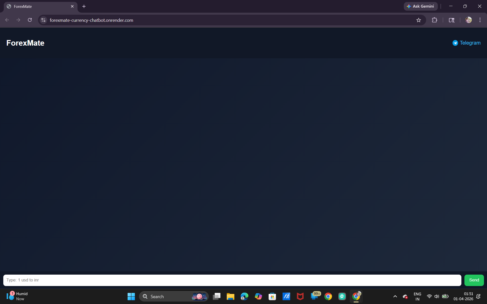
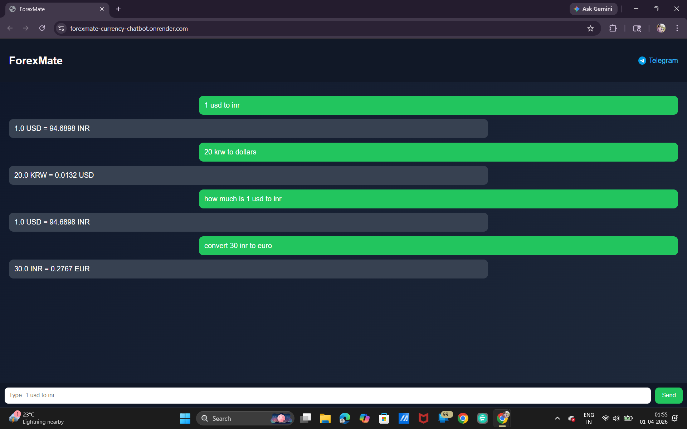

# ForexMate — AI Currency Converter Chatbot

ForexMate is a multi-platform currency conversion chatbot built using Flask, Dialogflow, and real-time exchange rate APIs. It supports natural language queries and works across a web interface, Dialogflow, and Telegram.

---

## Live Demo

Web Application:
https://forexmate-currency-chatbot.onrender.com/

Telegram Bot:
https://t.me/ForexMate_bot

---

## Features

* Natural language currency conversion
  Examples:

  * 100 USD to INR
  * convert 50 euros to rupees

* Real-time exchange rates using API integration

* Works across multiple platforms:

  * Web UI
  * Dialogflow
  * Telegram

* Chat-style interface

* Handles currency synonyms (usd, dollar, rupees, etc.)

* Supports basic conversational inputs such as greetings and help queries

---

## Tech Stack

* Frontend: HTML, CSS, JavaScript
* Backend: Flask (Python)
* NLP: Dialogflow
* API: ExchangeRate API
* Deployment: Render
* Integration: Telegram Bot

---

## Architecture

User (Web / Telegram / Dialogflow)
→ Flask Backend (Render)
→ Exchange Rate API
→ Response returned to user

---

## Setup (Local)

```bash
git clone https://github.com/Sai-Eshwari/forexmate-currency-chatbot.git
cd forexmate-currency-chatbot

pip install -r requirements.txt
python app.py
```

Open in browser:
http://127.0.0.1:5000

---

## Configuration

Update your API key inside app.py:

```python
API_KEY = "YOUR_API_KEY"
```

---

## Dialogflow Setup

* Create an intent for currency conversion

* Add parameters:

  * unit-currency
  * currency-name
  * number

*  Add intents and set pparameters to them.
*  Add entities to the intents trained. 

* Enable webhook

* Set webhook URL to:

https://forexmate-currency-chatbot.onrender.com/webhook

---

## Deployment

The application is deployed on Render using GitHub integration.
It uses gunicorn as the production server.

---

## Project Highlights

* Built a complete chatbot system integrating NLP, backend, API, and UI
* Implemented robust currency normalization for handling multiple input formats
* Designed a unified backend supporting Web UI, Dialogflow, and Telegram
* Solved real-world issues such as parameter extraction and request handling

---

## Screenshots

### Chat Interface


### Real-time Currency Conversion


### Dialogflow NLP Integration


### Telegram Bot Integration


---

## Author

Sai Eshwari
BTech CSE (AI/ML)

---

## Future Improvements

* Voice input support
* Currency trend visualization
* Multi-language support
* Enhanced conversational capabilities

---

## License

This project is for educational and demonstration purposes.
